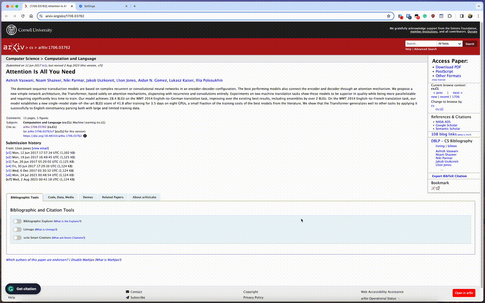

# Read arxiv paper with HTML5

[中文](./readme_cn.md)

This Tampermonkey script adds a convenient floating button to `arxiv.org`. Clicking the button allows users to open the paper in `ar5iv`, rendering arxiv paper into an HTML5 webpage. You can read the paper in your browser. 

## ✨ Features

- 🚀 **Easy to Use:** A floating "Open in ar5iv" button is automatically added to arxiv
- 🔄 **Dynamic Visibility:** The button only appears on abstract pages on the bottom.

## 🛠 Installation

1. Ensure [Tampermonkey](https://www.tampermonkey.net/) is installed in your browser.
2. Click to [Install from GitHub](https://raw.githubusercontent.com/nanguoyu/read-arxiv-paper-with-HTML5/main/read-arxiv-paper-with-HTML5.user.js).

## 📖 Usage

After installation, navigate to any arxiv paper (URLs starting with `arxiv.org/abs/`), such as [https://arxiv.org/abs/1706.03762](https://arxiv.org/abs/1706.03762). A floating "Open in ar5iv" button will appear at the bottom right of the page. Click it, and the paper in HTML5 format will open in a new tab in ar5iv.

## ⚙ Customization

You're welcome to fork this script and customize it to your preference. Suggestions and improvements are encouraged via pull requests!

## ⚠ Disclaimer

This script is provided "as is", without any warranty. Use at your own risk.

## 📜 License

This project is licensed under the [MIT](LICENSE).

## 🤝 Credits

Created by [Dong Wang](https://github.com/nanguoyu), with the assistance of ChatGPT from OpenAI.