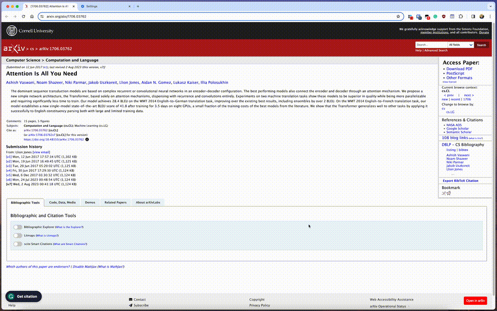

# 一键阅读arxiv文章的HTML5页面

[English](./readme.md)

这个 Tampermonkey 脚本为 `arxiv.org` 添加了一个方便的悬浮按钮。点击该按钮，用户可以在 `ar5iv` 中打开论文，将 arxiv 论文渲染为 HTML5 网页。您可以在浏览器中阅读论文。

## ✨ 特点

- 🚀 **易于使用：** 自动在 arxiv 添加“Open in ar5iv”的悬浮按钮
- 🔄 **动态可见性：** 该按钮仅在摘要页底部显示。

## 🛠 安装

1. 确保在您的浏览器中安装了 [Tampermonkey](https://www.tampermonkey.net/)。
2. 点击 [从 GitHub 安装](https://raw.githubusercontent.com/nanguoyu/read-arxiv-paper-with-HTML5/main/read-arxiv-paper-with-HTML5.user.js)。

## 📖 使用方法

安装后，导航至任何 arxiv 论文（URL 以 `arxiv.org/abs/` 开头），例如 [https://arxiv.org/abs/1706.03762](https://arxiv.org/abs/1706.03762)。页面右下角将出现一个悬浮的“Open in ar5iv”按钮。点击它，论文的 HTML5 格式将在 ar5iv 的新标签页中打开。

## ⚙ 定制

欢迎 Fork 此脚本并根据您的喜好进行定制。通过 Pull Requests 鼓励提出建议和改进！

## ⚠ 免责声明

此脚本“按原样”提供，不附带任何保证。使用风险自负。

## 📜 许可证

该项目根据 [MIT](LICENSE) 许可证授权。

## 🤝 致谢

由 [Dong Wang](https://github.com/nanguoyu) 创建，得到 OpenAI 的 ChatGPT 协助。